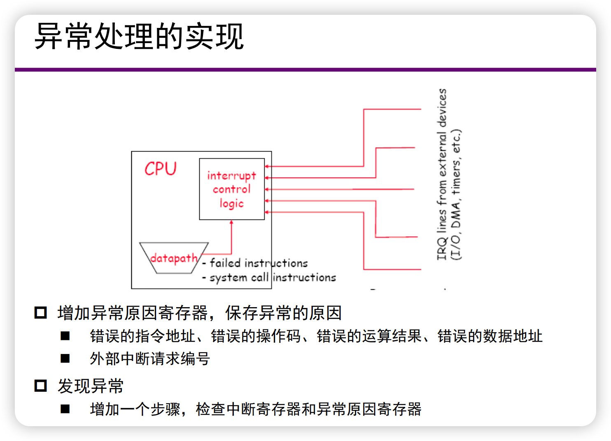
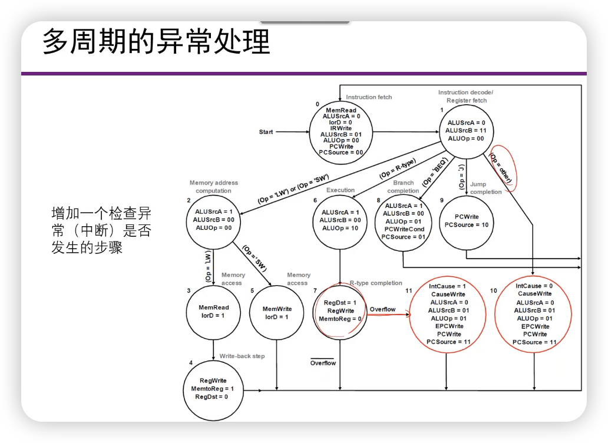
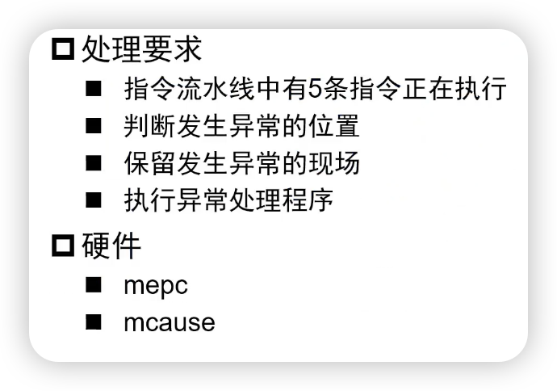

## 异常

- CPU运行时会遇到突发的不正常事件，包括：
  - 指令执行过程中发生错误
    - IF，ID，EXE，MEM
  - 外部设备提出服务请求
  - 多进程进行时与其他进程发生资源冲突

- 中断程序正常执行流程的事件
  - 来自CPU，称为**异常**
  - 来自外部设备，称为**中断**

## 异常响应和处理

- 很难在程序中进行处理

  - 时间、空间的不确定性

- 对程序“透明”处理

  - 程序正常运行
  - 由硬件检测发生异常或中断
  - “透明”地自动转换到服务程序进行响应和处理
    - 保存现场
    - 启动服务程序
  - 返回到程序执行
    - 恢复现场

  

  - 保存异常的原因：mcause

### 多周期的异常处理

增加一个检查异常（中断）是否发生异常的步骤：

- 保存现场
  - mepc
  - 当前的状态等（状态寄存器）
- 转异常处理程序（中断服务）
  - 根据异常原因，寻址处理程序的入口（PC的来源）
  - 跳转到处理程序执行（与转移指令相同）
- 处理完成后，返回主程序执行

### 流水线CPU的异常处理

## 精确处理和非精确处理

- 精确异常处理
  - mepc中保存有发生异常指令的地址
  - 操作系统处理简单
  - 指令流水情况下实现比较复杂
- 非精确异常处理
  - mepc中保存当前pc或者近似的pc
  - 由操作系统处理