## 控制冲突

- 是指流水线中的分支指令或者其他需要改写PC的指令造成的冲突。

- 包括无条件转移、条件转移、子程序调用、中断等。执行中可能改变程序的方向，从而造成流水线断流。
- 数据冲突影响到的仅仅是附近少数几条指令，称为局部冲突。而控制冲突影响的范围要大得多，会引起程序执行方向的改变，称为全局冲突。
- 当执行条件转移指令时，有两种可能结果：
  - 改为目标结果
  - +4
- 由于PC的缺失引发；条件转移和无条件转移指令
- 所有指令都要在IF阶段用PC，所以对性能影响很大

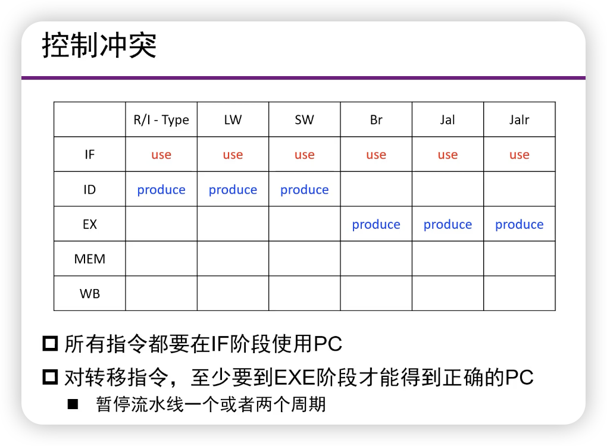

- Use表示用pc，Produce表示生成新pc。对转移指令，至少要等到EXE阶段才能得到正确PC

## 控制冲突的处理

- 暂停流水线
  - 直到拥有正确的转移地址，造成性能的降低
- 预测”分支不成功“
  - 顺序执行下一条指令
  - 预测失败后要清楚错误启动的指令
- 预测”分支成功“
  - 更复杂一些，因为要计算转移目的地址
  - 预测失败后要清除错误启动的指令
- 动态预测
  - 硬件根据上次分支的结果进行本次预测（？）

### 1. 暂停流水线

- 简单解决方法
  - 一旦发现分支指令就暂停流水线，直到分支指令达到MEM段确定了新的PC为止。

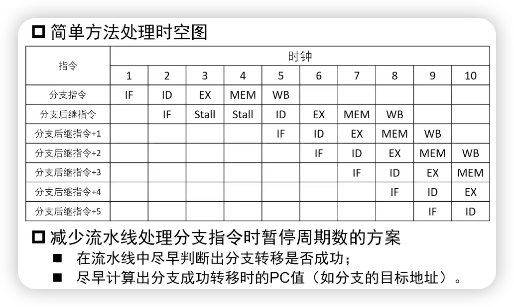

**LYY：第二行的第二个Stall实际上是IF，也就是说我们需要重新取一次指。有可能是pc+4，有可能是跳转的地址。暂停了两个周期。**

### 2. 分支预测

- 减少暂停周期数
  - 在流水线中尽早判断出分支转移是否成功
  - 尽早计算出分支成功转移时的PC值

- 一个例子：

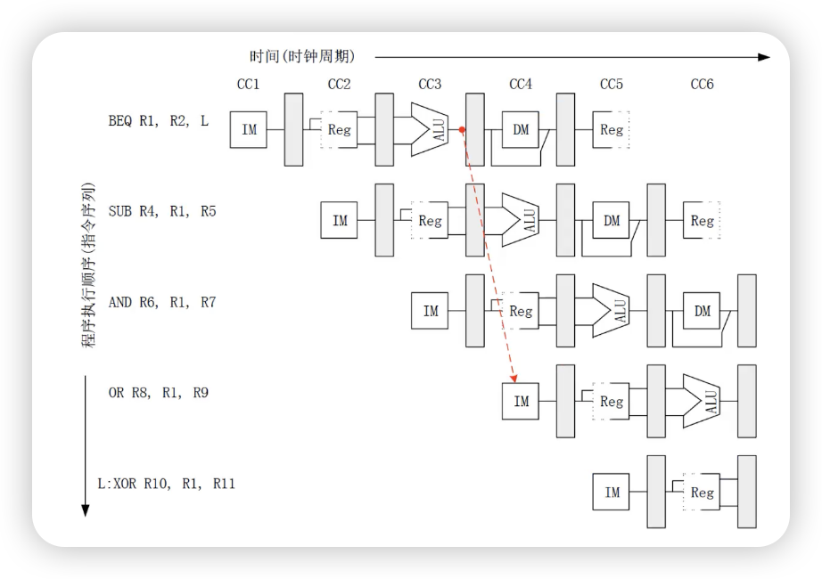

- 减少分支延迟：

  - 硬件在ID阶段就确定需要的信息，增加：
    - 目标地址加法器
    - 寄存器比较器
  - 例如：

  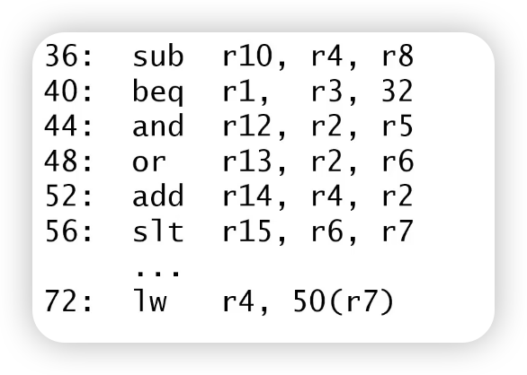

其数据通路图：

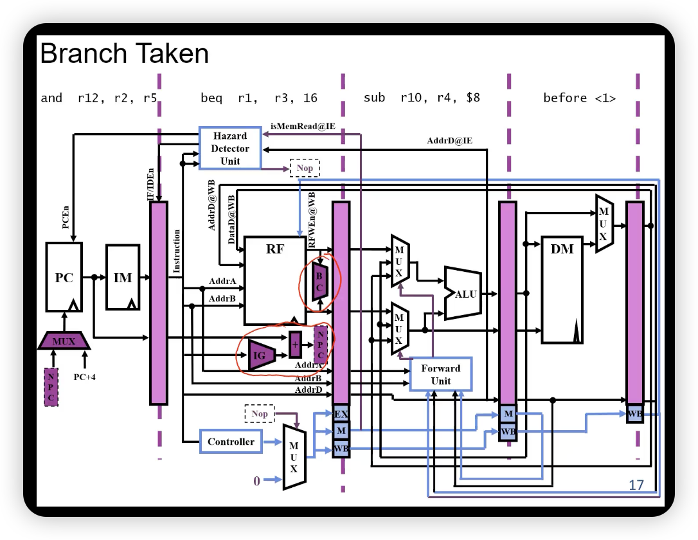

如果需要跳，原先的and操作被清除掉，变成一个NOP

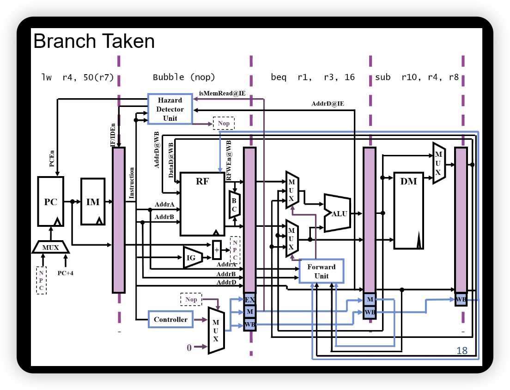

这就是预测**分支不成功**。

- 增加的部件
  - 数据通路
    - 增加比较器，完成源操作数的比较
    - 调整加法器到ID段，完成转移地址的计算
  - 控制信号
    - 根据比较结果，若相等则转移
      - PCsrc选择转移目标地址（PC <- 目的地址）
      - 清除IF/ID段寄存器的值（IF/ID寄存器 <- NOP）
      - 当前指令的控制信号为0（ID/EX寄存器 <- 0）
    - 若不等，则顺序执行
      - PCsrc选择顺序执行（PC <- PC + 4）
      - 保留IF/ID段寄存器的值
  - 数据旁路？

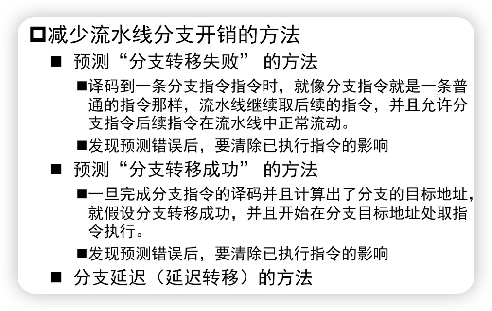

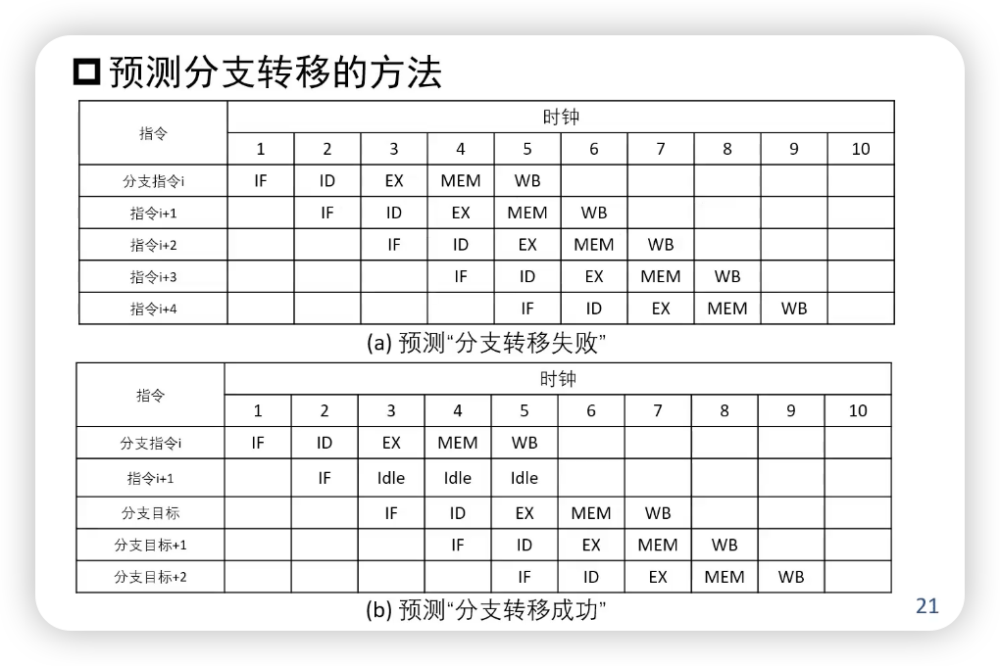

- 但比较器/加法器已经在ID阶段了（ID阶段已经知道跳不跳），所以第二张图其实已经不科学了。
- 数据通路如下图所示，把比较器和一个加法器移到了ID阶段。

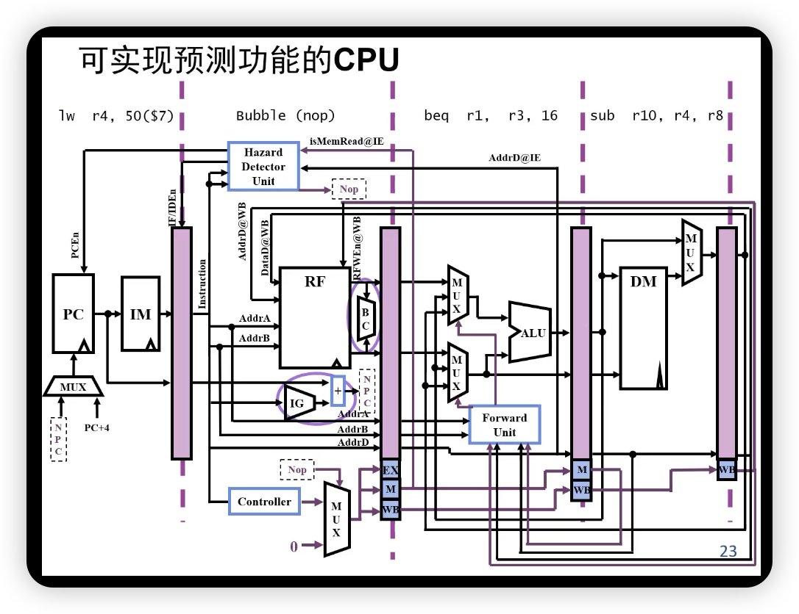

### 3. 控制冲突的动态调度

- 分支目标缓冲技术（Branch Target Buffer）
  - 缓冲区的每一项内容都被用来预测分支转移是否成功，并且根据实际的分支情况对内容进行修改。这种方法是基于如下的考虑：如果本次分支转移成功了，那么预测下一次分支转移也成功，例如一个循环体就是这种情况
  - 将分支转移成功的分支指令的地址和它的分支目标地址都放到一个缓冲区中保存起来，缓冲区以分支指令的地址作为标志；在取指令阶段，所有的指令地址都与保存的标志做比较，如果相同，就认为本条指令是分支指令，而为认为它分支转移成功，同步它的分支目标（下一条指令）地址就是保存在缓冲区的分支目标地址。

```C++
for (int i = 0; i < 10; ++i) {
  // ...
}
```

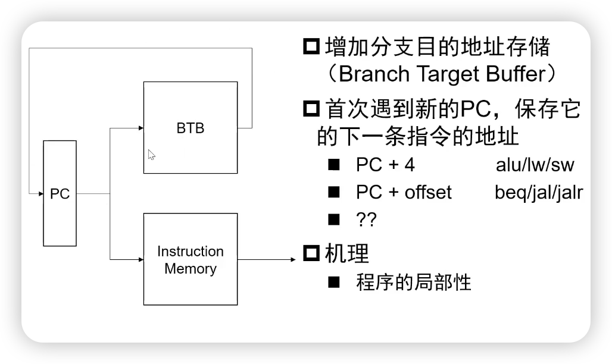

- 减少BTB容量

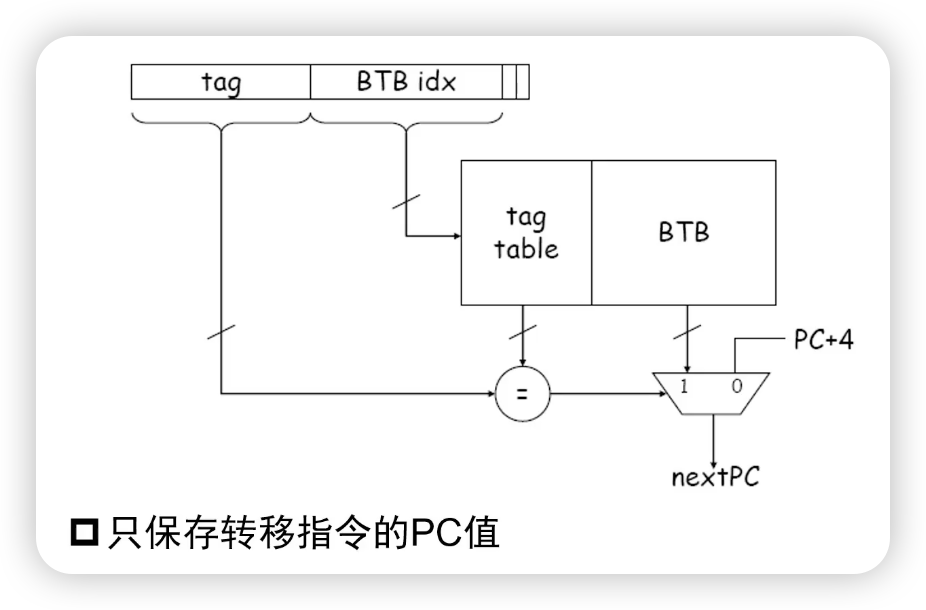

- 预测策略：

  - 如果上次跳转了，认为下次要跳转
  - 如果上次没跳转，认为下次不跳转

  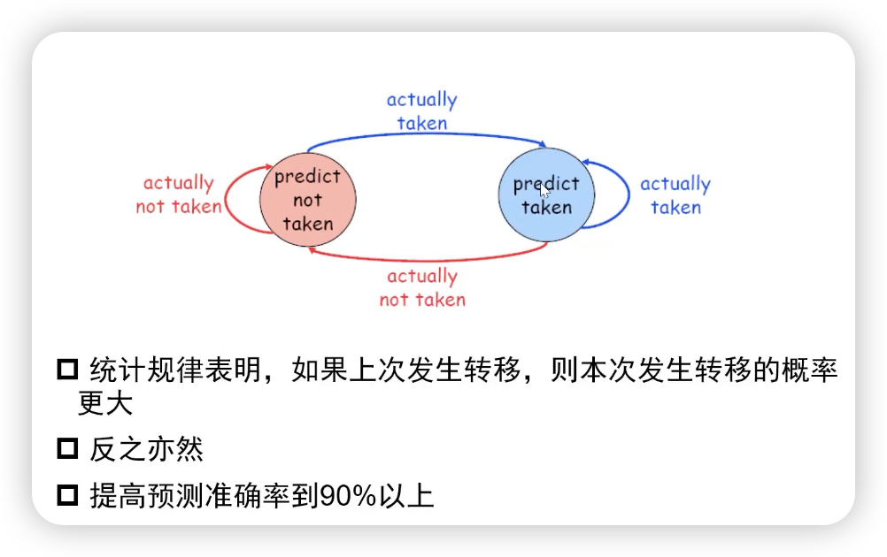

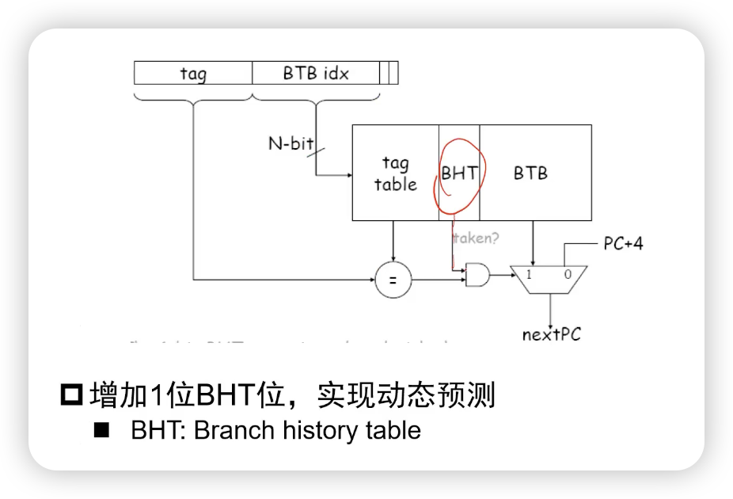

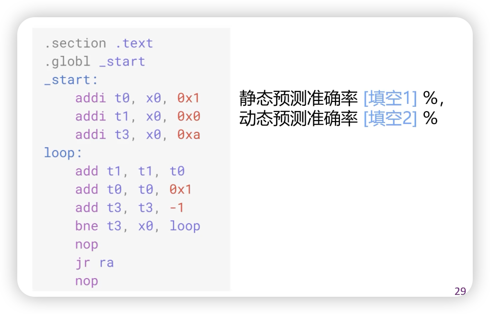

- 答案：10%， 80%（假设前者是预测不成功，后者第一次是先预测不成功）