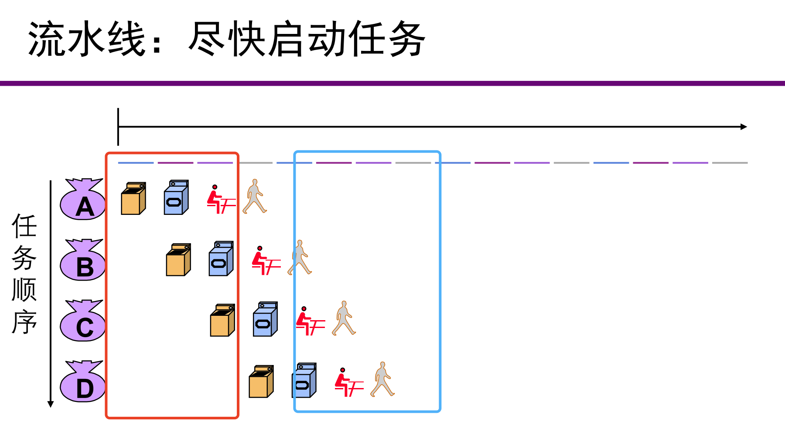
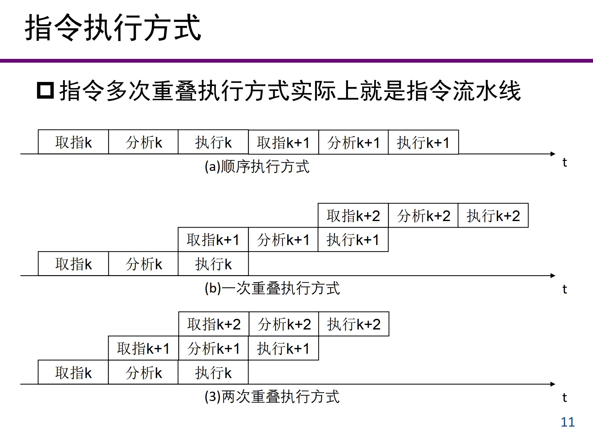

# 流水线CPU

## 流水线操作的前提

- **任务**分解成多个**步骤**完成
- 每个**步骤使用不同的资源**
- 任务内部存在关联，完成每个**任务**的**步骤顺序一致**
- **任务之间相互独立**，没有依赖关系

## 流水线特性

- 流水线**并没有缩短单个任务的延迟**，但提高了整个系统的**吞吐率**
  - 吞吐率：单位时间执行任务的数量
- 多个任务同时运行，占用不同的资源
- 可能的（理想的）**加速比=流水段数**
  - 考虑任务数趋于无穷的情况
- 流水线效率**受限于用时最长的阶段**
  - 所以我们需要尽可能均匀地切分任务
- 若每个阶段的用时不同，将降低流水线效率
  - ？

- 装入和排空流水线也可能降低加速比
  - 装入：图中红框部分，各资源还没有被充分利用时
  - 排空：图中蓝框部分，各资源开始不再被使用
- *冲突将引起流水线的**暂停***
  - 暂停肯定能解决问题

## 流水线概念

- 计算机中的流水线是把一个重复的过程分解成若干个子过程，每个子过程与其他子过程并行进行。

- 提高处理机内部的并行性

  - 空间并行性，在一个处理机内设置多个独立的操作部件，并使这些部件并行工作（比如把单周期CPU复制四份）；
  - 时间并行性，就是采用流水线技术。只需增加少量硬件就能把运算速度提高几倍。

- 计算机各个部分都可以采用流水线技术

  - 指令流水线：指令的执行过程采用流水线
  - 操作部件流水线：运算器中的操作部件，如浮点加法器、浮点乘法器等可以采用流水线
  - 宏流水线：多个计算机之间，通过存储器连接，可以采用流水线

  

## 指令流水阶段

一条指令的执行过程可以分为多个阶段：取指，分析（译码），执行。

- 如果各阶段的时间相等，都为t，则n条指令所用的时间为：
  - 顺序执行：$T=3nt$
  - 一次重叠执行：$T=(1+2n)t$
  - 两次重叠执行：$T=(n+2)t$
  - 注意$n$前的系数和常数的变化规律
- 