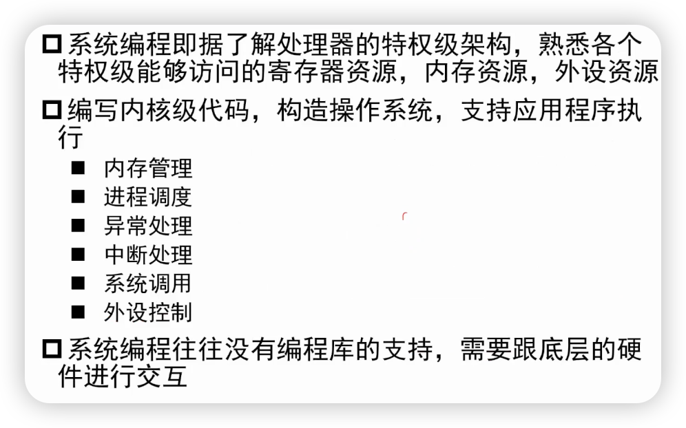
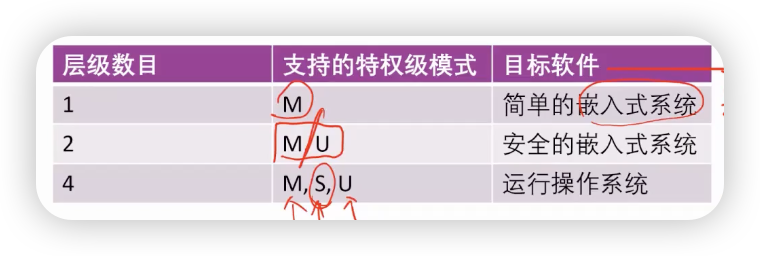
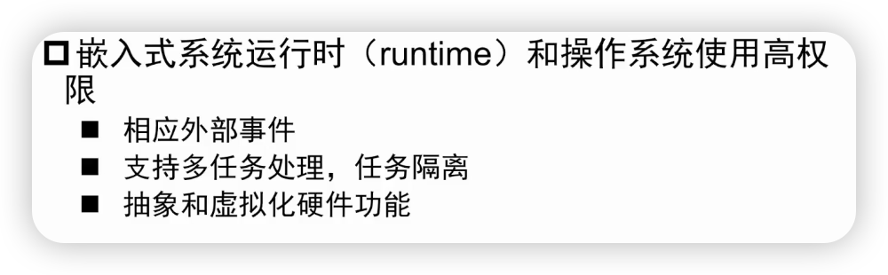
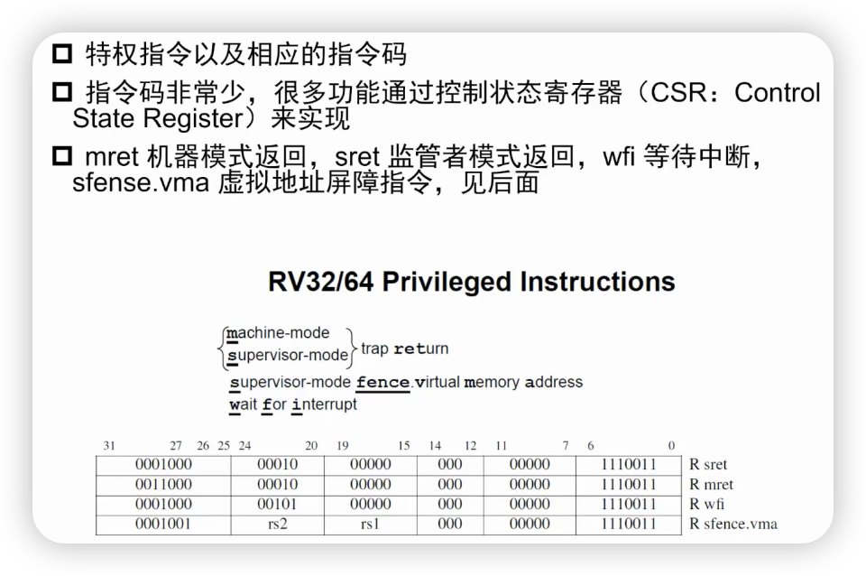
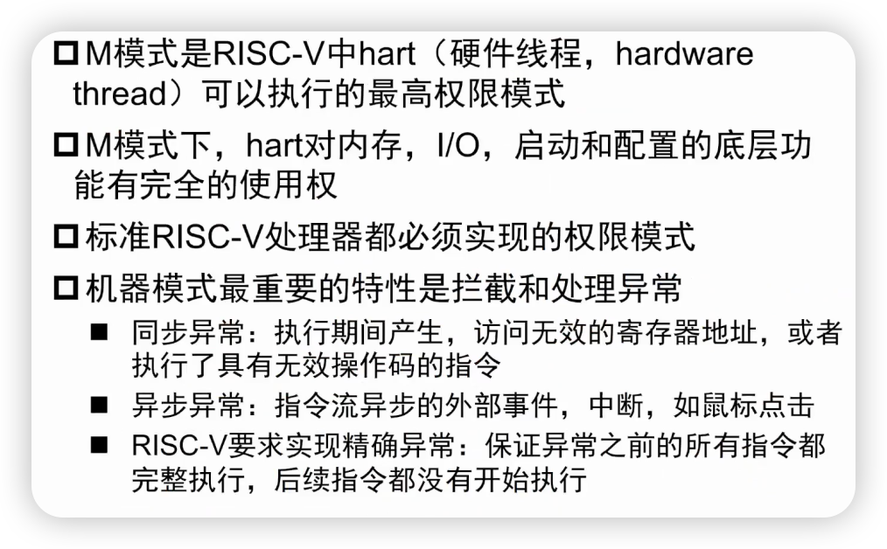

## RISC-V系统模式

- 现代处理器一般具有多个特权级的模式，每一个特权级所能够执行的指令以及能够访问的处理器资源是不同的
- 例如：处理器可以具有用户态和内核态两个特权级模式
  - 用户态：专门执行应用程序
  - 内核态：专门执行操作系统
  - 应用程序**不能访问OS的数据结构，不能直接使用外设资源**
  - 内核态的操作系统**具有完全的硬件控制能力**

### 系统架构的编程

### RISC-V的特权级模式

- 用户模式（user mode）：U，执行用户应用程序的模式
- 机器模式（machine mode）：运行最可信的代码，直接接触硬件
- 监管者模式（supervisor mode）：为现代操作系统，例如Linux等提供支持

- **machine模式拥有最高级的权限**

### 权限

- 更高权限的模式可以使用更低权限模式的功能，反之不成立
- 更高权限的模式有额外的功能
  - M模式，可以处理终端，执行输入输出
- 处理器大部分时间运行在低权限，**中断和异常**时会将控制权移交到更高的权限模式

### RISC-V特权指令

- 控制状态寄存器：CSR（Control State Register）
- return：从M-mode或S-mode中返回
  - 怎么进入trap？调用ecall
- wfi：等待中断
- sfence.vms：处理虚拟地址转换

## M-mode

