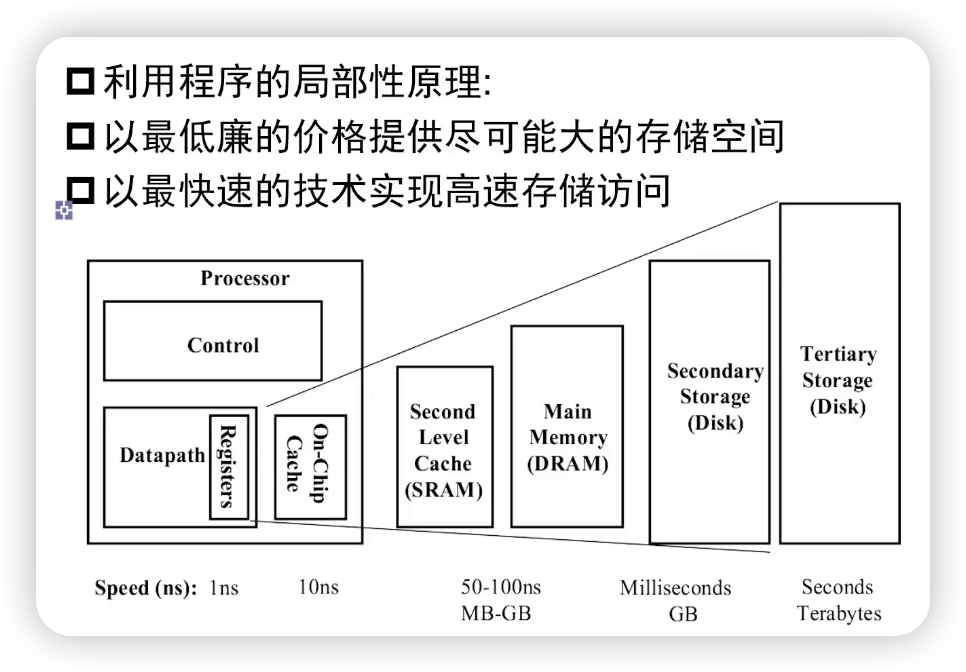
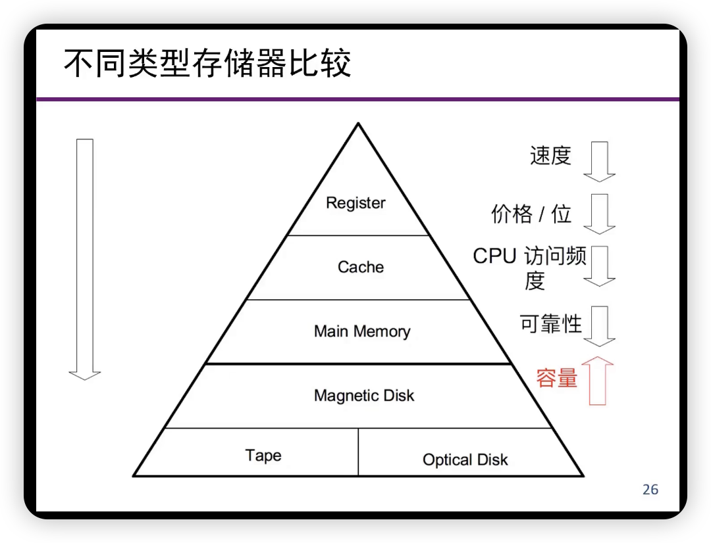
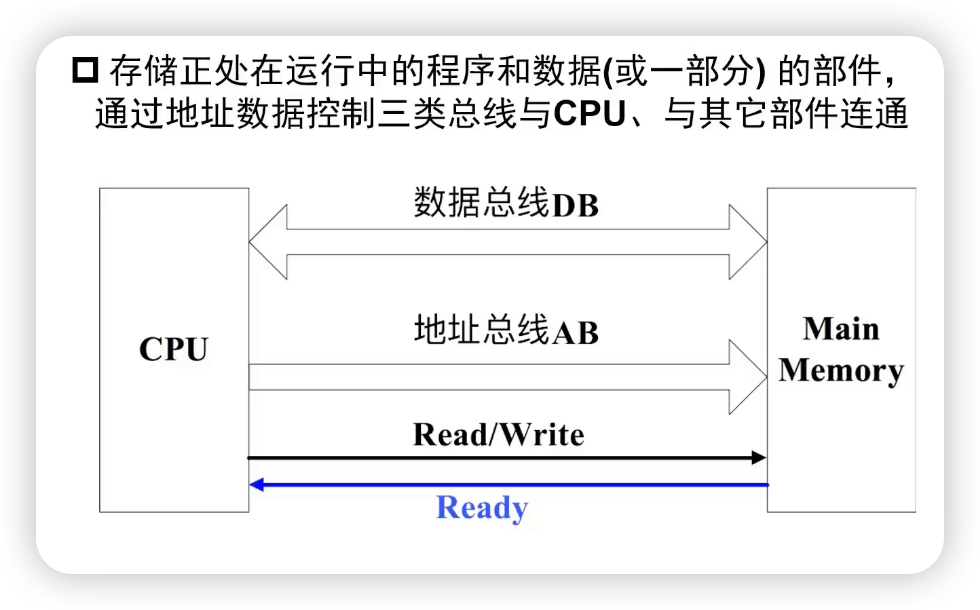
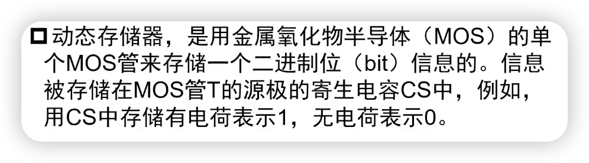
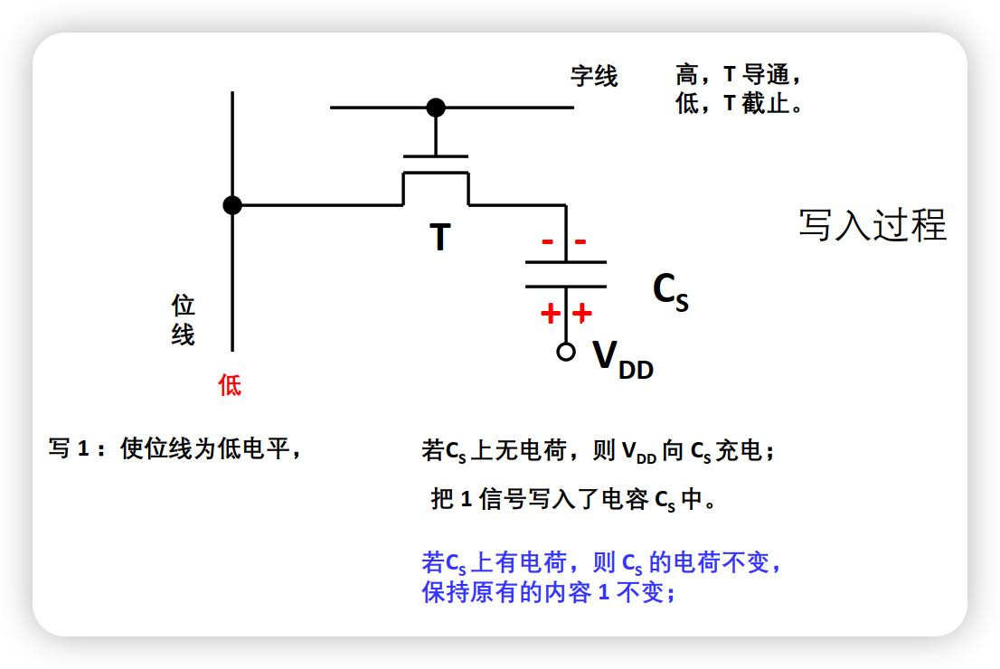
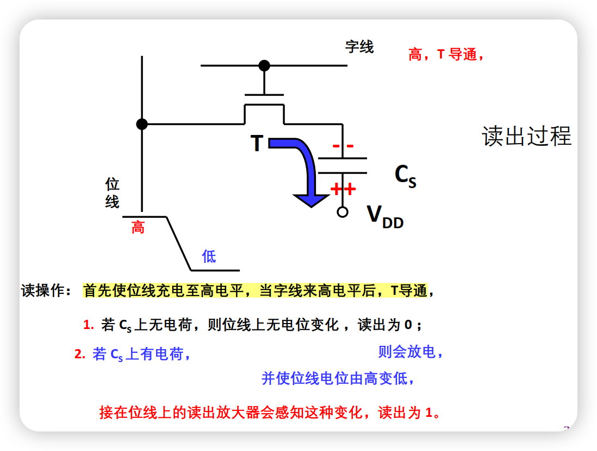
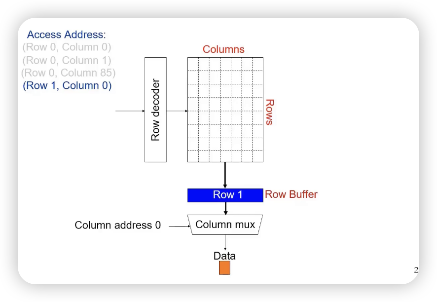
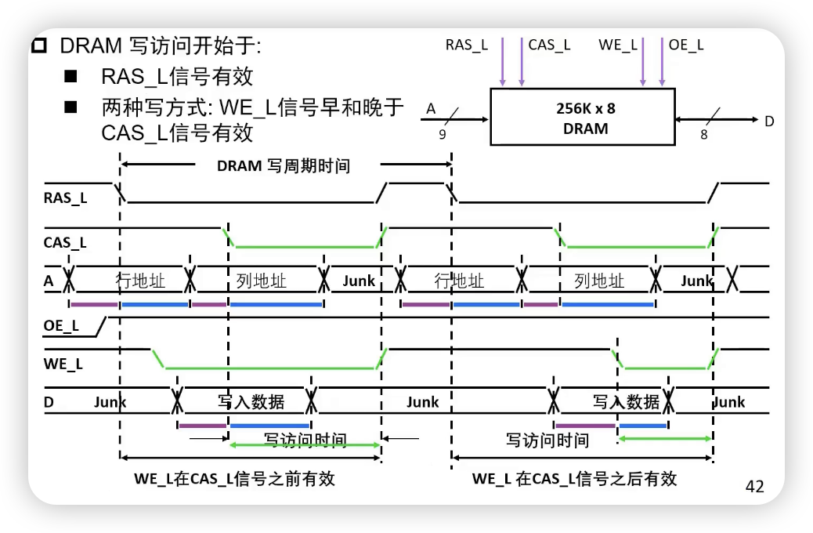

# 动态处理器

## 对存储介质的基本要求

- 稳定状态来表示0和1
- 容易识别
- 两个状态能方便地转换
- 常见的存储方式：磁颗粒、半导体、光

- 早起存储器：水银延迟线存储器，EDSAC，1949， 利用水波来存储信息（只能维持一段很短的时间）
- 磁芯存储器：加电流可以改变磁场方向，记为0和1，消磁以后重写

- 半导体存储器：利用MOS管寄生电容，触发器。**随机访问**（RAM，SRAM，DRAM）。还有ROM。
  - RAM：访问时间与存放位置无关，半导体存储器
  - SAM（顺序访问）：按照存储位置依次访问，磁带存储器
  - DAM（直接访问）：随机+顺序，磁盘存储器（圆环+顺序）
  - CAM（关联访问，Content Addressable Memory / CAssociated Memory）：**根据内容访问**，cache和TLB（拿着Tag去依次比较）

## 存储器系统设计目标

- 尽可能快的存取速度
- 尽可能大的存储空间
- 尽可能低的单位成本（价格/位）
- 较高的可靠性

- **摩尔定律**：晶体管数量每18个月会翻一番
  - CPU性能每年增长60%，DRAM性能每年增长9%

> 假定某台计算机的处理器工作在：
>
> ​	主频=1GHz（机器周期为1ns）
>
> ​	CPI=1.1
>
> ​	50%算数逻辑指令，30%存取指令，20%转移指令
>
> 假如10%的存取指令会发生数据缺失，需要50个周期的延迟，那么CPI=？
>
> 
>
> ***Sol.***
>
> CPI=理想CPI+每条指令的平均延迟
>
> ​      =1.1 + (0.3 * 0.1 * 50) = 1.1 + 1.5 = 2.6
>
> 也就是说，CPU 58%的时间花在等待存储器给出数据，每1%的指令的数据缺失将给CPI附加0.5个周期。

- 目前现实：大容量存储器速度慢，快存储器容量小

- 实现目标的方法：**层次的存储器系统**。

- 速度：SRAM (on chip) (1-3 cycles) > SRAM (off chip) (5-15 cycles) > DRAM (~150 cycles) > SSD (Flash) (Tens of thousands) > Disk (Millions)

## 层次存储器系统

- 高速度
  - 静态存储器速度高，设置为较小容量的高速缓冲存储器
- 大容量
  - 价格适中，速度适中，DRAM可以作为**主存储器**
- 低成本
  - 磁盘存储器价格低，作为辅助存储器，或者作为虚存的载体

- 程序运行的局部性原理：
  - 在一小段**时间**内，最近被访问过的程序和数据很可能被再次访问
  - 在**空间**上这些被访问的程序和数据往往集中在一小片存储器
  - 在访问顺序上，指令顺序执行比转移执行的可能性大（大约为5:1）
- 层次之间满足的原则：
  - 一致性原则，处在不同层次存储器的同一个信息是一致的
  - 包含性原则，处在内层的信息一定被包含在外层存储器中。即**内层存储器的全部信息，是相邻外层存储器中一部分信息的复制品。**（现在不一定了，实际上也有exclusive的）

- 主存储器
  - Register, Cache, Main Memory
- 辅助存储器
  - Disk, Tape, Compact Disc

## 主存储器

- 作用与连接

（逻辑和SRAM是一样的）

- 地址总线
  - 地址总线用于选择主存储器的一个存储单元（字或字节），其位数决定了能够访问的存储单元的最大数目，称为最大可寻址空间。例如，当按字节寻址时，20位的地址可以访问2^20=1MB的存储空间，32位地址可以访问4GB的存储范围。
- 数据总线
  - 用于在计算机各功能部件之间传送数据，数据总线的位数与（总线）时钟频率的乘积，与该总线所支持的最高数据吞吐（输入/输出）能力成正比。
- 控制总线
  - 用于指明总线的工作周期类型和本次入/出完成的时刻。保持和DRAM打交道的诗序。

## DRAM

### 工作原理

1T1C：一个晶体管，一个电容

### 工作特点

- 破坏性读出 (PreCharge)
  - 读出时被强制清零
  - 预充电延迟：读操作后，被读单元内容被清零，必须把刚读出的内容写回去。在结束这个过程前不能开始下一次读。
- 需定期刷新（会漏电, Refresh）
  - 集中刷新：停止读写，逐行将所有行刷新一遍
  - 分散刷新：每次读写后，刷新一行，各行轮流进行。或在规定的时间内，如2ms，能轮流把各行刷新一遍。
  - 这里有一个读不同行的例子：要注意读完 (0, 85) 后要把第0行写回去。
  

- 快速分页组织的存储器
  - 行、列地址要分两次给出，但连续地读写用到相同的行地址时，也可以在前一次将行地址锁存，之后仅送列地址，以节省送地址的时间。

### 写时序

### 读时序

